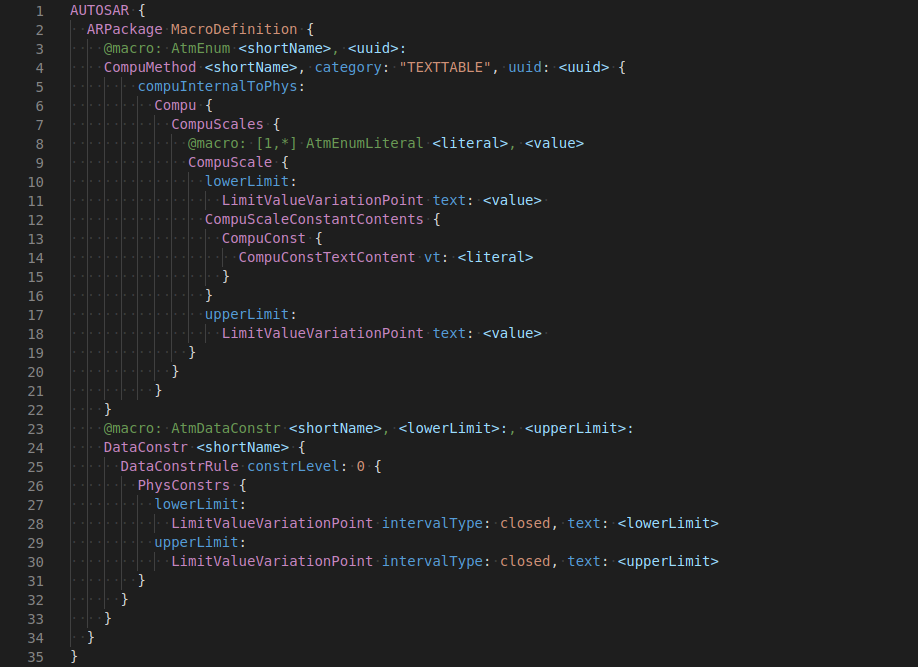
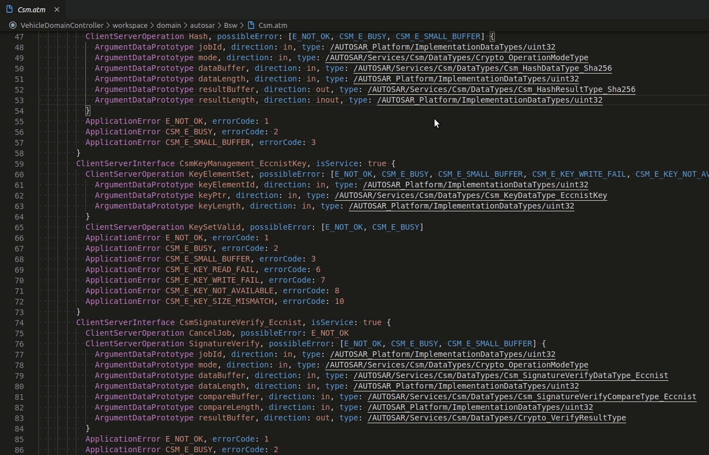
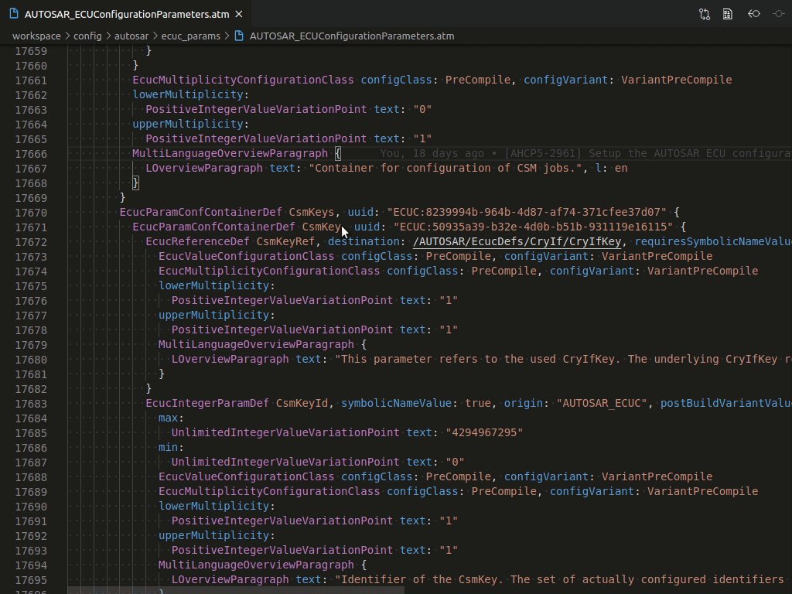
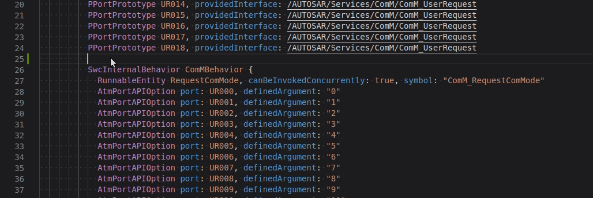

# Automate VSCode Extension

[](https://marketplace.visualstudio.com/items?itemName=maxdanify.automate) [](https://marketplace.visualstudio.com/items?itemName=maxdanify.automate)

This is the ESR Automate Textual Language support plugin for Visual Studio Code. [ESR Labs Automate](https://www.esrlabs.com/work/automate/) - a lightweight yet powerful approach to AUTOSAR software development.

## Getting Started
Syntax highlighting works out-of-the-box. For other features ESR Automate RText service is required. How to configure the RText service see the ESR Automate User Manual, Chapter Editor Back-End Service. Basically you have to create the `.rtext` configuration file with the command for the `*.atm` file extension.

```
*.atm:
automate-rtext-service <args...>
```

## Features

- Automate Textual syntax highlighting.
- Auto-completion of language commands and command attributes.
- Improved navigation, developers can follow references across files and jump backward to source elements.

## Syntax Highlighting
The ESR Automate VSCode extension add a new language identifier `Automate` and associate it with `.atm` files to support the syntax higlighting. However, you may try to use it with another RText based language, to do this run the the `Change Language Mode` command (`Ctrl+K M`) and select the `Automate` language for the file.



## Navigation
### Link References
Use `Ctrl+click` on link references to navigate between model elements. This feature does not work with short references, but you can use the `Go to References` instead.



### Find All References
Execute `Find All References` (`Alt+Shift+F12`) or a `Go to References` search (via `Shift+F12`) to see the result inline.



## Auto-completion
Use `Ctrl+space` to show the completion list.



## Requirements

- RText service is part of the ESR Labs Automate product and it's required for some features. [Get Automate](https://www.esrlabs.com/work/automate/).

## Extension Settings
This extension contributes the following settings:

* `automate.enable`: enable/disable this extension
* `automate.useRTextServer`: enable/disable Automate RText service

## Visual Studio Marketplace
This extension is available on the [Visual Studio Marketplace](https://marketplace.visualstudio.com/items?itemName=maxdanify.automate) for Visual Studio Code.

## Questions, issues and contributions
- If you come across a problem with the extension, please [file an issue](https://github.com/mdanilov/automate-vscode-extension/issues)
- If you have a question about how to work with the extension, please contact [Maksim Danilov](https://github.com/mdanilov)

